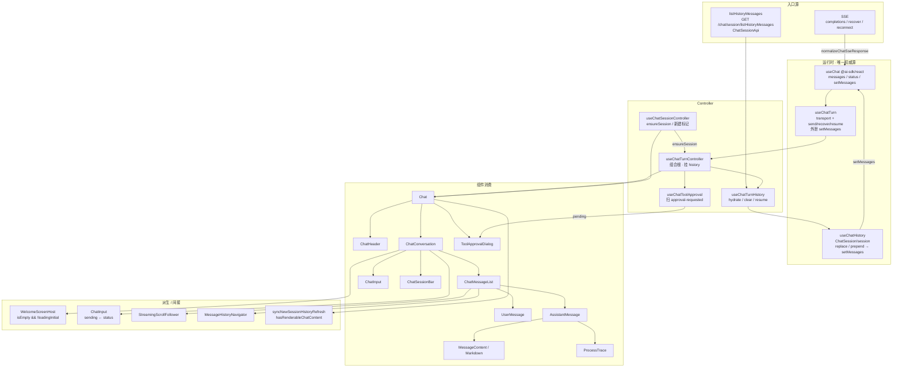

```mermaid
flowchart TB
  subgraph SRC["入口源"]
    SSE["SSE<br/>completions / recover / reconnect"]
    HIST["listHistoryMessages<br/>GET /chat/session/listHistoryMessages<br/>ChatSessionApi"]
  end

  subgraph RT["运行时 · 唯一权威源"]
    USECHAT["useChat @ai-sdk/react<br/>messages / status / setMessages"]
    USECHATTURN["useChatTurn<br/>transport + send/recover/resume<br/>外泄 setMessages"]
    USECHATHIST["useChatHistory<br/>ChatSession/session<br/>replace / prepend → setMessages"]
  end

  subgraph CTRL["Controller"]
    TURNHIST["useChatTurnHistory<br/>hydrate / clear / resume"]
    TURNCTRL["useChatTurnController<br/>组合根 · 挂 history"]
    APPROVAL["useChatToolApproval<br/>扫 approval-requested"]
    SESSION["useChatSessionController<br/>ensureSession / 新建标记"]
  end

  subgraph UI["组件消费"]
    CHAT["Chat"]
    HDR["ChatHeader"]
    CONV["ChatConversation"]
    LIST["ChatMessageList"]
    USER["UserMessage"]
    ASST["AssistantMessage"]
    MD["MessageContent / Markdown"]
    TRACE["ProcessTrace"]
    INPUT_UI["ChatInput"]
    BAR["ChatSessionBar"]
    DIALOG["ToolApprovalDialog"]
  end

  subgraph DER["派生 / 间接"]
    WELCOME["WelcomeScreenHost<br/>isEmpty && !loadingInitial"]
    INPUT["ChatInput<br/>sending ← status"]
    SCROLL["StreamingScrollFollower"]
    NAV["MessageHistoryNavigator"]
    SIDE["syncNewSessionHistoryRefresh<br/>hasRenderableChatContent"]
  end

  SSE -->|"normalizeChatSseResponse"| USECHAT
  HIST --> TURNHIST --> USECHATHIST -->|"setMessages"| USECHAT
  USECHAT --> USECHATTURN --> TURNCTRL
  TURNCTRL --> TURNHIST
  TURNCTRL --> APPROVAL
  SESSION -->|"ensureSession"| TURNCTRL
  TURNCTRL --> CHAT
  SESSION --> CHAT

  CHAT --> HDR
  CHAT --> CONV
  CHAT --> DIALOG
  CHAT --> SIDE
  APPROVAL -->|"pending"| DIALOG
  CONV --> LIST
  CONV --> WELCOME
  CONV --> INPUT_UI
  CONV --> BAR
  CONV --> INPUT
  LIST --> USER
  LIST --> ASST
  LIST --> SCROLL
  LIST --> NAV
  ASST --> MD
  ASST --> TRACE
```

基线：`a68e7559` 之前（对照 commit `d47fc39f`）。已按 git 纠正：历史接口本就是 GET + ChatSessionApi；Session/Header/Bar/Input 当时已存在，只是旧图漏画。
